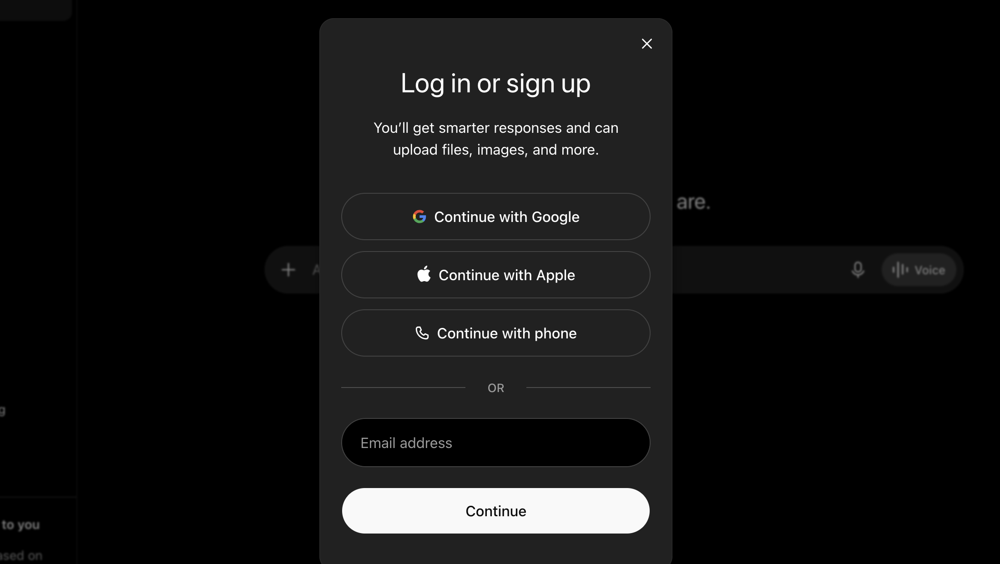
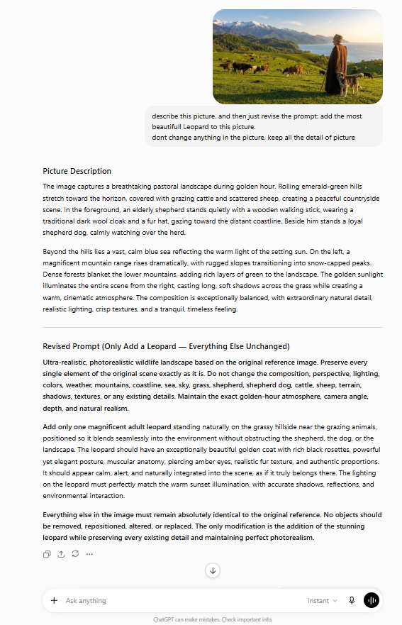
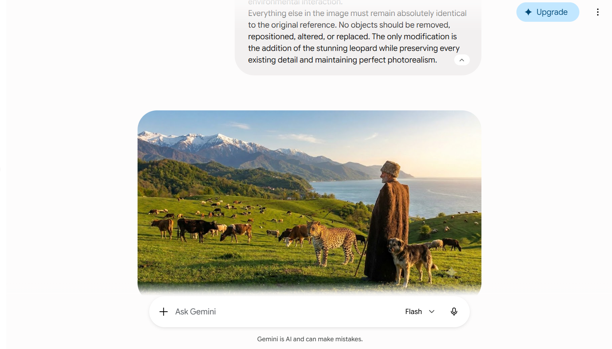
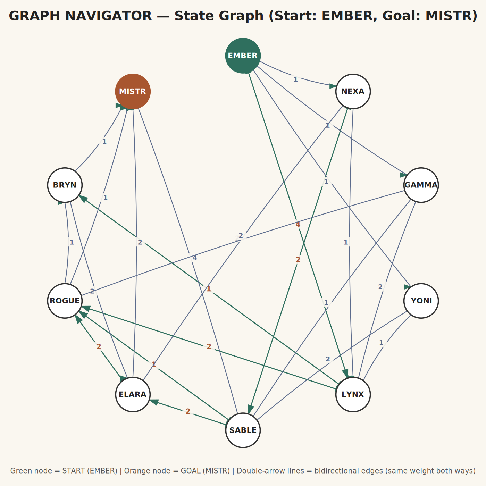

# Introduction to AI — Final Exam Answers
**Faezeh Demneh**

---

## Task 1: Using generative AI


---

## Task 2: User Manual — Adding a Leopard using ChatGPT

This manual explains, step by step, how to sign up for ChatGPT and use it to add a leopard to an image.

### Step 1: Sign up / Log in

1. Go to [https://chat.openai.com](https://chat.openai.com)
2. Click **"Sign up"** if you don't already have an account, or **"Log in"** if you do.
3. Complete registration using your email address or a Google/Microsoft account.
4. Once logged in, you will land on the main ChatGPT chat screen.



### Step 2: Start a new chat and upload the image

1. Click **"New chat"** in the sidebar.
2. Click the **attachment (paperclip)** icon next to the message box.
3. Select and upload the template image (`picture-template.jpeg`).



### Step 3: Write the editing prompt

1. In the message box, describe the edit you want clearly. For example:

   > "Add a leopard to this picture, making it blend naturally with the lighting, scale, and perspective of the scene."

2. Press **Enter** (or click the send button) to submit the request.



### Step 4: Review and download the result

1. ChatGPT will generate the edited image with the leopard added.
2. Click on the generated image to open it at full size.
3. Click the **download** icon to save the final image to your computer.


### Initial picture


### Final result


---

## Task 3: Finding the graph

Explored the chat bot at the "Graph Navigator" URL. Start node: **EMBER**, Goal node: **MISTR**. Every reachable node and transition is shown below.



**Full adjacency list (node → destination(weight)):**

```
EMBER (START) → NEXA(1), GAMMA(1), YONI(1), LYNX(4)
NEXA  → LYNX(1), SABLE(2), ELARA(2)
GAMMA → LYNX(2), SABLE(1), ROGUE(2)
YONI  → LYNX(1), SABLE(2)
LYNX  → EMBER(4), BRYN(1), ROGUE(2)
SABLE → NEXA(2), ROGUE(1), ELARA(2), MISTR(4)
ELARA → SABLE(2), ROGUE(2), MISTR(2)
ROGUE → LYNX(2), SABLE(1), BRYN(1), MISTR(1), ELARA(2)
BRYN  → LYNX(1), ELARA(2), MISTR(1)
MISTR (GOAL) → (end, no further moves)
```

---

## Task 4: Build a web application

The GPA calculator web application is committed under the `gpa/` directory of this repository as a single self-contained HTML file (`gpa/index.html`), with embedded CSS and JavaScript and no external libraries.
